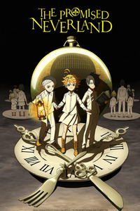

# **Anime Recommendations**
| [Recommendations]RecsMain.md) | 
| ----------- | 
> Hi! My name is Dominique and here's a list of mystery animes I've enjoyed watching in the past that I'd recommend to you guys below.

##  1.  $\color{Brown}{The Promised Neverland}$

### ```Summaries```

> At Grace Field House, life couldn't be any better for the orphans.  Although the children live together as siblings, they are not related. Grace Field House is where
children without parents live. An irreplaceable orphanage for 38 children who all live seemingly perfect lives every day and a loving "Mama" who cared for them deeply.
Their home was nice, bellies were full, and their caretaker loved them very much. No child was overlooked and would be adopted by the age of 12. In their daily lives, they
go over rigorous courseworks and tests but enjoy hours of playtime outside. However there was one rule they must obey: *do not leave the orphanage*.
But one day, the top-scoring orphans, Emma and Norman, venture past the gate and unearth the harrowing secret behind their entire existence. Utilizing their quick-wittedness,
the children must work together to somehow change their predetermined fate. the happy days at Grace Field House turn out to be a false paradise.
In truth, their home isn't an orphanage, but a farm, and the children aren't orphans, but cattle, destined to be slaughtered and sold as human meat for demons.
Meanwhile, the mom they love is actually a watchdog working for the demons.

 #### ``Genre:`` Fantasy, Horror, Mystery, Adventure

## 2. $\color{Blue}{Erased}$

### ```Summaries```

> A 29 year old man lives a quiet and peaceful life working at a pizza place when he is experiencing a strange phenomenon he calls 'Revival'. When 'Revival' happens, Satoru Fujinuma is brought back into the past where he must prevent an incident from happening. One day, he gets falsely accused of the murder of his mother, and the phenomenon occurs, but this time he gets sent back 18 years in the past which is during his elementary school period. With the mind of a 29 year old and the body of a child, he needs to find out what he must change to revoke this accusation and get back to the present.

#### ```Genre:``` Crime, Drama, Detective Mystery, Fantasy, 
## 3. $\color{Yellow}{Banana Fish}$

### ```Summaries```

> Ash a teen gang leader with a past of sexual abuse is trying to find out the mystery of the drug banana fish. Simply put, Banana Fish is the story of rebellion and revenge by Ash Lynx against his former “master.” Thought to be cold-hearted to a fault, Ash has that demeanor broken when he comes in contact with a Japanese boy named Eiji Okumura, who came to America as a photography assistant to a news reporter looking to run a story on Ash. An intangible friendship between the two of them develops and Ash gains a secondary purpose of protecting Eiji and preserving their friendship at any cost.

#### ```Genre:``` Action, Thriller, Crime, Drama, Adventure, Mystery
